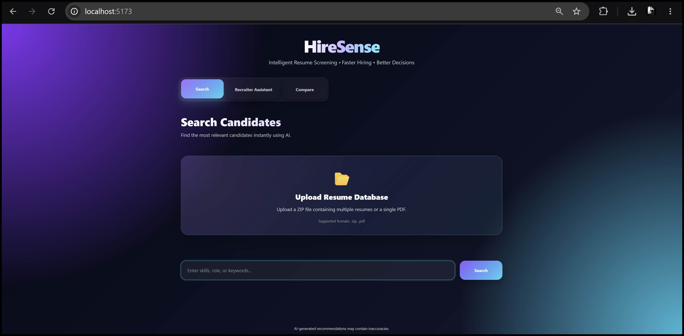
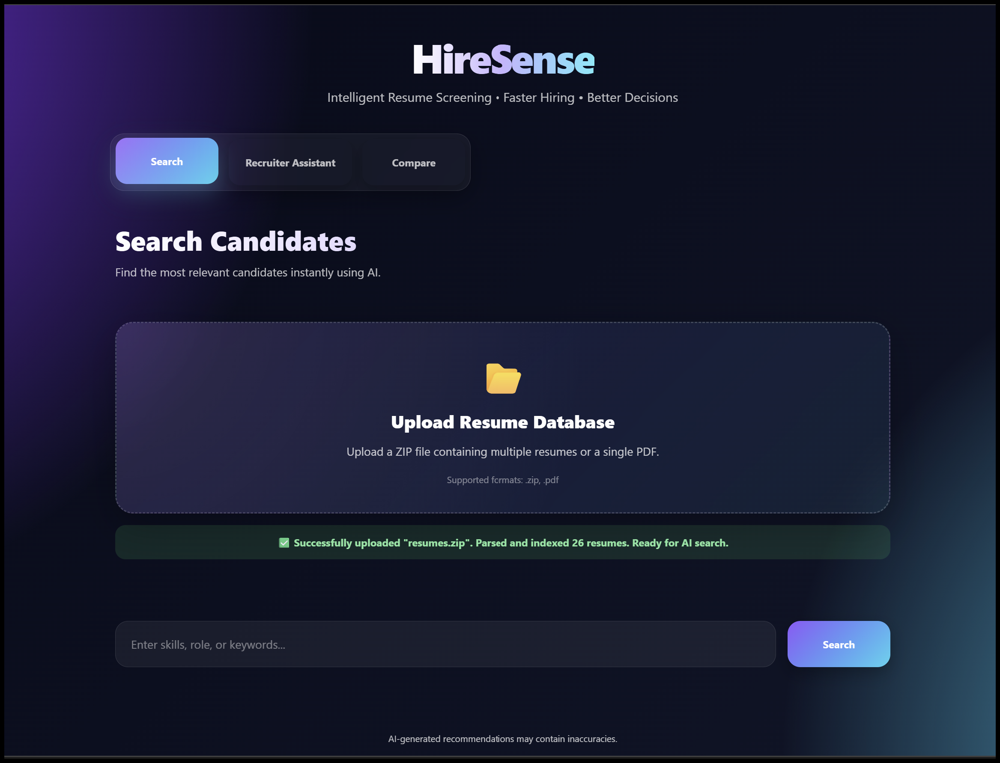
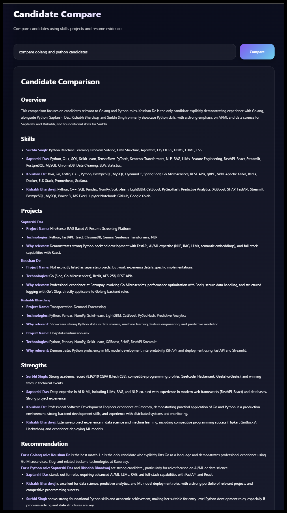

# HireSense - AI Resume Screening Platform


An end-to-end AI-powered recruitment assistant that helps recruiters efficiently search, compare, and evaluate candidates using **Retrieval-Augmented Generation (RAG)**, **semantic vector search**, and **Gemini-powered reasoning**.

---

# 🎥 Demo

> 🚧 **Demo video coming soon**

Replace the placeholder below after recording your walkthrough.

```text
https://youtu.be/your-demo-link
```

---

# 📸 Screenshots

## 🏠 Home Dashboard

Modern React dashboard providing access to resume upload, semantic search, candidate comparison, and AI recruiter features.



---

## 📤 Resume Upload

Upload multiple resumes in ZIP format for automated parsing, embedding generation, and indexing.



---

## 🔍 Semantic Candidate Search

Retrieve and rank candidates using semantic similarity instead of traditional keyword matching.


---

## ⚖️ Candidate Comparison

Compare applicants based on skills, projects, experience, and AI-generated recruiter insights.



---

## 🤖 Recruiter AI Assistant

Ask natural language questions and receive evidence-based answers from retrieved resumes using RAG.


---

# 📖 Overview

Traditional recruitment requires manually reviewing hundreds of resumes.

HireSense automates this workflow by combining semantic retrieval, vector search, and Large Language Models to help recruiters quickly identify the best candidates.

Example recruiter queries:

* Find Python backend developers with FastAPI experience.
* Compare Python and Golang candidates.
* Who worked on RAG?
* Which candidate has the strongest backend project?
* Who has AWS experience?
* Which candidate is suitable for an ML Engineer role?

---

# ✨ Key Highlights

* AI-powered semantic resume search
* Bulk ZIP resume ingestion
* Resume parsing and structured profile extraction
* Candidate ranking with confidence scores
* AI-powered candidate comparison
* Recruiter Question & Answer assistant
* ChromaDB vector database
* Retrieval-Augmented Generation (RAG)
* Gemini-powered candidate insights
* Modern React dashboard with FastAPI backend

---

# 🚀 Features

## 📄 Resume Processing

* Bulk ZIP resume upload
* PDF resume parsing
* Automatic text extraction
* Structured candidate profile extraction
* Resume summarization
* Embedding generation
* ChromaDB vector storage

---

## 🔍 Semantic Candidate Search

* Natural language candidate search
* Semantic similarity search
* AI-powered candidate ranking
* Match score calculation
* Confidence estimation
* Resume preview and download

---

## 🤖 AI Recruiter Assistant

* Resume-based recruiter Q&A
* Candidate comparison
* AI-generated recruiter recommendations
* Evidence-based responses using RAG
* Structured candidate summaries

---

## 💻 Frontend

* Modern responsive React dashboard
* Resume upload interface
* Candidate search
* Candidate comparison
* Recruiter AI assistant
* Resume viewer

---

# 🛠 Tech Stack

### Backend

* Python
* FastAPI
* ChromaDB
* Sentence Transformers
* Gemini 2.5 Flash
* NLTK

### Frontend

* React
* Vite
* CSS

### AI & Retrieval

* Retrieval-Augmented Generation (RAG)
* Semantic Search
* Vector Embeddings
* Candidate Ranking
* Large Language Models (LLMs)

---

# 🧠 AI Pipeline

```text
Resume Upload (ZIP / PDF)
           │
           ▼
     Resume Parsing
           │
           ▼
Candidate Profile Extraction (Gemini)
           │
           ▼
   Embedding Generation
           │
           ▼
 Store in ChromaDB
           │
           ▼
 Natural Language Query
           │
           ▼
   Semantic Retrieval
           │
           ▼
 Candidate Ranking
      │            │
      ▼            ▼
Candidate Cards  AI Recruiter Assistant
                     │
                     ▼
      Candidate Comparison & Resume Q&A
```

---

# 📂 Project Structure

```text
HireSense/
│
├── app/
│   ├── api/
│   ├── services/
│   ├── models/
│   └── utils/
│
├── frontend/
│   ├── src/
│   ├── public/
│   └── styles/
│
├── screenshots/
│   ├── home.png
│   ├── upload.png
│   ├── search.png
│   ├── compare.png
│   └── qa.png
│
├── requirements.txt
├── main.py
└── README.md
```

---

# ⚙️ Run Locally

## Backend

```bash
pip install -r requirements.txt

uvicorn main:app --reload
```

---

## Frontend

```bash
cd frontend

npm install

npm run dev
```

---

# 🚀 Future Improvements

* Recruiter authentication
* Candidate analytics dashboard
* Hybrid Search (BM25 + Vector Search)
* PostgreSQL + pgvector
* Cloud storage integration
* Docker deployment
* CI/CD pipeline
* Cloud deployment
* Resume recommendation engine

---

# 👨‍💻 Author

**Saptarshi Das**

Built as a production-style AI Engineering project demonstrating:

* Retrieval-Augmented Generation (RAG)
* Semantic Resume Search
* Vector Databases
* FastAPI Backend Development
* React Frontend Development
* Gemini-powered AI Recruiter Assistant

---

⭐ **If you found this project interesting, consider giving it a star!**
